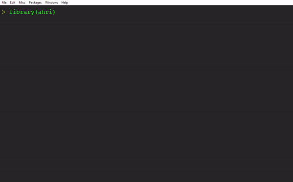

## AHRI R library

The `ahri` R library contains a family of functions for working with and
analyzing the Africa Health Research Institute (AHRI) datasets. These
functions can read in the AHRI datasets, write them to .Rda format,
accept a list of arguments to standardize the analyses, subset and set
the data, create or get variables, and calculate trends in HIV incidence
and other epidemiological measures.

The R code is at the development branch:
<https://github.com/vando026/ahri_dev>.

The wiki help pages serve as a short introduction to the `ahri` library.
These can be found in the links below. The help files are organised as
follows:

  - Getting started, which describes how to install the `ahri` library,
    which AHRI datasets to request and where to put them. It also shows
    how to set the paths to these datasets.
    <https://github.com/vando026/ahri/wiki/1-Getting-started>

  - Reading and writing the datasets, which describes the functions for
    performing these operations.
    <https://github.com/vando026/ahri/wiki/2-Read-functions>

  - Set functions, which describes a range of functions for processing
    the data, subsetting the data, and other data tasks.
    <https://github.com/vando026/ahri/wiki/3-Set-functions>

  - Make and get variables, which describes a range of functions for
    performing these operations. (Documentation ongoing.)
    <https://github.com/vando026/ahri/wiki/4-Make-and-get-variables>

  - HIV function to make the HIV incidence datasets, impute the
    seroconversion dates, perform multiple imputation, and calculate
    annual HIV incidence.
    <https://github.com/vando026/ahri/wiki/5A-HIV-functions> and
    <https://github.com/vando026/ahri/wiki/5B-HIV-functions>

  - G-imputation functions to impute the seroconversion times
    conditional on auxiliary data.
    <https://github.com/vando026/ahri/wiki/6-G-Imputation>

There are other sources of help:

  - The `ahri` package has help files and documentation. Type `?ahri` to
    get to the help pages. For more information on a specific function,
    for example `setFiles`, type `?setFiles`.

  - Please consult the issues page on this Github site for more
    information and for answers to questions someone before you may have
    already asked. There are also through discussions with users about
    the approach to coding the `ahri` library:
    <https://github.com/vando026/ahri/issues?q=is%3Aissue+is%3Aclosed>

  - If you have questions, post them as an issue so that I or others can
    answer.
    (<https://help.github.com/en/github/managing-your-work-on-github/creating-an-issue>)

|                                                                                                                                                                                                                                                                                       |
| ------------------------------------------------------------------------------------------------------------------------------------------------------------------------------------------------------------------------------------------------------------------------------------- |
| Disclaimer: This is not an official AHRI site. The `ahri` library is a collaboration between researchers using the AHRI datasets. Decisions made in the code about how to manage and analyze the data are independent of the views, opinions, and policies of AHRI and its employees. |
